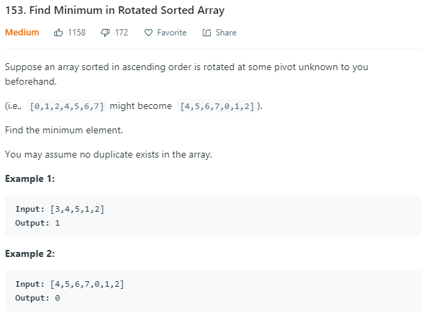

## Question

## Solution

同樣是Q.33的變形，本次要找出最小的數值。解法仍然跳脫不了binary search 的方法，當指標把陣列限縮到一個或兩個數字時，只要輸出最後的那個數字則必定為最小值(因數列已被排序且翻轉過)。比較需要注意的是有可能middle point剛好落在切分點的位置，此時不能直接將head 與 tail 指標移至middle point 的右方或左方。

總結而言，這次的演算法流程為

- 判斷陣列頭尾哪個數字較大，若陣列第一個數字最小則直接回傳此數字 (代表陣列沒有被翻轉)
- 逐次計算middle point 的數值，直到head 與 tail 指標中間沒有任何數值
    - 若middle point 位置數字 大於 head 位置數字
        - middle point未在反轉點前，移動 head 指標
        - middle point洽在反轉點前，回傳陣列[middle point +1] 的數值
    - 若middle point 位置數字 小於 head 位置數字
        - middle point未在反轉點後，移動 head 指標
        - middle point洽在反轉點後，回傳陣列[middle point] 的數值

- 已達停止點仍未回傳資訊時，代表tail指標上的數字為最小值，回傳此數值
    
## Score
