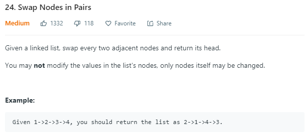

## Question

## Solution

此題相較起來比較直覺，困難點可能只是在實踐時的邏輯跟整潔度。在做交換的動作時，我們需要
    - 抓住Linklist交換處的前端
    - 抓住Linklist交換處的後端
    - 針對交換處的兩個ListNode做交換再重新連結到整個Linklist的前端跟後端

交換完後持續檢查後面是否還有兩個以上的ListNode再做交換即可。

比較直觀需要記住的位置有a. 交換處的上一個Node b. 交換處的兩個Node c. 交換處的下一個Node 共四個變數(solution.ipynb)，以此方式已可在36-32ms的計算時間提交通過 (約快於78%~94%的提交)，然而在交換時也可以只使用三個變數就完成(紀錄於solution_3var.ipynb中)，提交時的運算時間則為28ms(快於99.11%的提交)。

## Score
