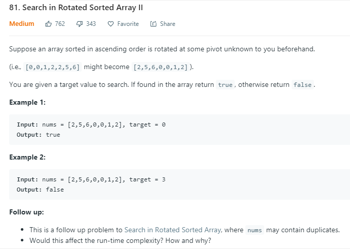
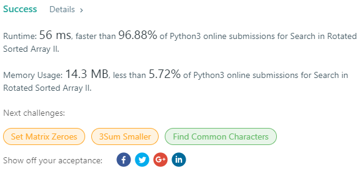

## Question

## Solution

此題為Q.33 的延伸，在輸入數列中解除了"數字不重複"的限制，因此在做搜尋前，需要針對頭與尾兩個index 判斷相鄰的數字是否相同，如果相同則要移動index位置直到與頭/尾相鄰的數字不同再開始做搜尋。增加的這個運算會導致原本的O(logn)時間複雜度增加到O(n) (可以想像最極端的狀況是輸入的陣列內數值皆相同，此時我們需要花n次遍歷陣列然後結束所有運算)

- 2019/08/25 新增： 在討論區上看到另一個tricky 的作法，直接用python 內建的 in 一行結束 (return target in nums)

## Score
